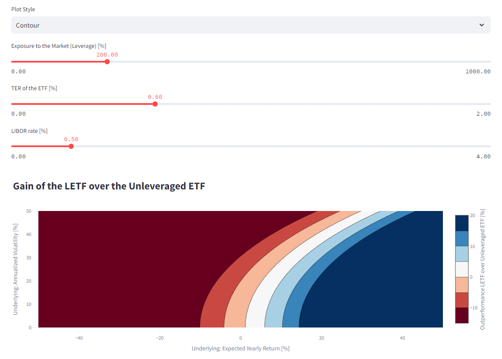

# Volatility Decay Visualizations with Streamlit (and Dash)

This project contains visualizations of the volatility decay phenomenon as well as calculations regarding the Kelly criterion to deal with volatility decay. It is based on the [volatility decay equation](https://www.reddit.com/r/HFEA/comments/tue7n6/the_volatility_decay_equation_with_verification/) as well as a [paper](https://papers.ssrn.com/sol3/papers.cfm?abstract_id=1664823) and corresponding [blogpost](https://www.afrugaldoctor.com/home/leveraged-etfs-and-volatility-decay-part-2) dealing with leveraged (ETF) investing and in the light of the [Kelly criterion](https://rhsfinancial.com/2017/06/20/line-aggressive-crazy-leverage/). The project is built with and hosted on [Streamlit](https://volatilitydecayapp.streamlit.app/) and was initially built with Dash.

## Installation

Install the given requirements - otherwise the file is required for Streamlit to run the app. For Dash, the additional requirements are given in the initial docstring, along with CSS assets in the `assets` folder.
